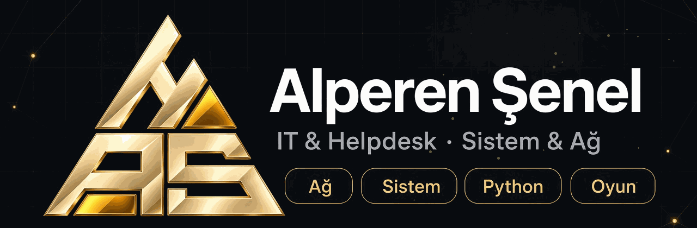
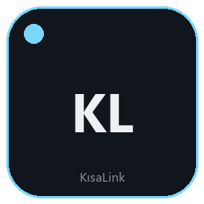
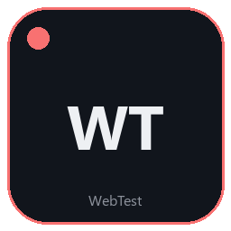
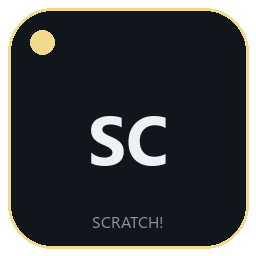
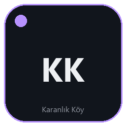

 

 

 

İstanbul Nişantaşı Üniversitesi'nde **Teknoloji Destek Hizmetleri Uzmanı** olarak çalışıyorum. Son kullanıcı desteği, donanım arızaları, ağ cihazları ve kampüs operasyonlarını yönetiyorum. Paralelinde Python otomasyonları, web araçları ve çok oyunculu tarayıcı oyunları geliştiriyorum.

`IT & Helpdesk` · `Sistem & Ağ` · `3.5+ yıl saha deneyimi`

## Odak

| Ağ ve altyapı | Sistem ve destek | Kod |
| --- | --- | --- |
| Router, switch, IP, DNS, DHCP, TCP/IP | Windows istemci, Active Directory, donanım onarımı, ITSM | Python, JavaScript, TypeScript, React, C++, WebSocket |

## Şu an

**Teknoloji Destek Hizmetleri Uzmanı** · İstanbul Nişantaşı Üniversitesi · 2026 — devam ediyor

Kampüs içi son kullanıcı desteği, bilgisayar / yazıcı / projeksiyon yönetimi, switch ve kablolama sorunları, IP kamera kurulumu ve envanter takibi.

**Serbest yazılım geliştirici & IT danışmanı** · 2024 — devam ediyor

Yapay zekâ destekli otomasyonlar, web araçları, çok oyunculu oyunlar ve müşteri siteleri.

## Eğitim

**Yapay Zekâ ile Kodlama** · Anadolu Üniversitesi · 2026 — devam ediyor

**İnternet ve Ağ Teknolojileri** · Ondokuz Mayıs Üniversitesi · 2025 — devam ediyor

**Yönetim Bilişim Sistemleri** · Nişantaşı Üniversitesi · 2016 — 2020

## Projeler

| | | |
| :---: | --- | --- |
|  | **[Tomyrs X](https://github.com/saltatrix-hub/tomyrs-x)** | Windows 11 debloat, performans ve GPU ayarlarını tek arayüzde birleştiren C#/WPF masaüstü uygulaması. [Kurulumu indir](https://github.com/saltatrix-hub/tomyrs-x/releases/latest/download/TomyrsX-Setup.exe) |
|  | **[KısaLink](https://kisalink.alperensenel.com)** | Bağlantı kısaltma, parola oluşturma ve görsel düzenleme. [Kaynak](https://github.com/saltatrix-hub/kisalink.alperensenel.com) |
|  | **[QR Kod Oluşturucu](https://qr.alperensenel.com)** | Özelleştirilebilir QR kodlar. [Kaynak](https://github.com/saltatrix-hub/qr.alperensenel.com) |
|  | **[WebTest](https://webtest.alperensenel.com)** | DNS, güvenlik başlıkları ve web servis kontrol paneli. [Kaynak](https://github.com/saltatrix-hub/webtest.alperensenel.com) |
|  | **[SCRATCH!](https://scratch.alperensenel.com)** | Gerçek zamanlı çizim ve tahmin oyunu. [Kaynak](https://github.com/saltatrix-hub/scratch.alperensenel.com) |
|  | **[Karanlık Köy](https://vampirkoylu.alperensenel.com)** | Mobil öncelikli Vampir Köylü. [Kaynak](https://github.com/saltatrix-hub/vampir-koylu) |
|  | **[Son Vardiya](https://github.com/saltatrix-hub/Son-vardiya)** | 1–4 oyunculu co-op zombi hayatta kalma. |

## Sertifikalar

Innova

- CCNA Eğitim
- Cisco Kablosuz Ağ Temelleri

BTK Akademi

- Ağ Temelleri
- Bilgi Teknolojilerine Giriş

İstanbul Üniversitesi

- Bilgisayar Programcılığı

## Araçlar

## GitHub

 

Site, LinkedIn veya e-posta üzerinden yazabilirsin.

[alperensenel.com](https://alperensenel.com) · [LinkedIn](https://www.linkedin.com/in/alperensenel) · [alperensenel37@gmail.com](mailto:alperensenel37@gmail.com)

